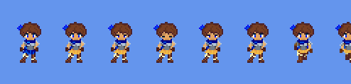

# Welcome to asefile
This library is a utility for just loading aseprite image data
## What is untested/unsupported?
- Grayscale and indexed colors are untested
- Encoding back into an aseprite file is unsupported
- Tiles are untested
## Future goals
- To support encoding
- Test other color encodings
# Example: Render in MonoGame
```csharp
private Texture2D chicaTexture;

public override void LoadContent()
{
    // Load the ase file and render it to a texture
    AseFile chicaFile = new AseFile("chica.aseprite");
    chicaTexture = GenerateTexture2DFromAseFile(chicaFile, GraphicsDevice);
}
protected override void Draw(GameTime gameTime)
{
    // ...
    // draw the texture to the window
    SpriteBatch.Draw(chicaTexture, new Vector2(100, 100), null, 
        Color.White, 0.0f, Vector2.Zero, Vector2.One * 2, SpriteEffects.None, 1f);
}
public static Texture2D GenerateTexture2DFromAseFile(AseFile aseFile, GraphicsDevice graphicsDevice)
{
    var resultTexture = new Texture2D(graphicsDevice, aseFile.Width * aseFile.Frames.Count, aseFile.Height);
    // Allocate a pixel buffer that acomodates all of the frames by multiplying the width by number of frames
    Color[] chicaBuffer = new Color[(aseFile.Width * aseFile.Frames.Count) * aseFile.Height];
    Array.Fill(chicaBuffer, Color.Transparent);
    for (int frame = 0; frame < aseFile.Frames.Count; frame++) // render each frame
    {
        int offsetX = frame * aseFile.Width;
        foreach (var cel in aseFile.Frames[frame].Cels)
        {
            // Loop through each pixel in the cel, and blit it into the buffer
            for (int celY = 0; celY < cel.HeightInPixels; celY++)
            for (int celX = 0; celX < cel.WidthInPixels; celX++)
            {
                var pixel = cel.PixelData[celX + celY * cel.WidthInPixels];
                if (pixel.A == 0)
                    continue;
                chicaBuffer[(offsetX + celX + cel.XPos + ((celY + cel.YPos) * aseFile.Width * aseFile.Frames.Count))] =
                    // asefile is System.Drawing.Color - and monogame uses Xna color
                    new Color(pixel.R, pixel.G, pixel.B, pixel.A);
            }
        }
    }
    resultTexture.SetData(chicaBuffer);
    return resultTexture;
}
```
The results will look like this:


# Example: Render in Godot 4
This example is a little bit more simple. Presuming you have a Sprite2D named Sprite2D in your tree, the code is mostly the same:
```csharp
public partial class Node2D : Godot.Node2D
{
    private Sprite2D sprite;
    // Called when the node enters the scene tree for the first time.
    public override void _Ready()
    {
        AseFile aseFile = new AseFile("chica.aseprite");
        sprite = GetNode<Sprite2D>("Sprite2D");
        sprite.TextureFilter = TextureFilterEnum.Nearest;
        sprite.Texture = GenerateTexture2DFromAseFile(aseFile);
    }
    public static ImageTexture GenerateTexture2DFromAseFile(AseFile aseFile)
    {
        Image img = Image.Create(aseFile.Width * aseFile.Frames.Count, aseFile.Height, false, Image.Format.Rgba8);
        for (int frame = 0; frame < aseFile.Frames.Count; frame++) // render each frame
        {
            int offsetX = frame * aseFile.Width;
            foreach (var cel in aseFile.Frames[frame].Cels)
            {
                // Loop through each pixel in the cel, and blit it into the buffer
                for (int celY = 0; celY < cel.HeightInPixels; celY++)
                for (int celX = 0; celX < cel.WidthInPixels; celX++)
                {
                    var pixel = cel.PixelData[celX + celY * cel.WidthInPixels];
                    if (pixel.A == 0)
                        continue;
                    img.SetPixel(offsetX + celX + cel.XPos, celY + cel.YPos,
                        new Color((float)pixel.R/255, (float)pixel.G/255, (float)pixel.B/255, (float)pixel.A/255));
                }
            }
        }
        return ImageTexture.CreateFromImage(img);
    }
}
```
From that the output will look the same as the above picture, except in Godot a dark grey background is the default.
With a restructure of this code a `SpriteFrames` could be constructed for an `AnimatedSprite2D`.